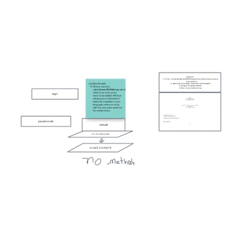

# array-insert-shift.

The arrayInsertShift function takes in an array and a value to be added to the middle of the array. It returns a new array with the added value in the middle position.

## Usage

The arrayInsertShift function takes two parameters: arr and val. arr is an array of integers, and val is the value to be inserted into the middle of the array.
